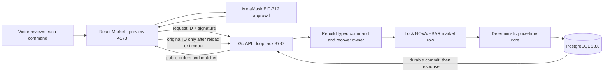
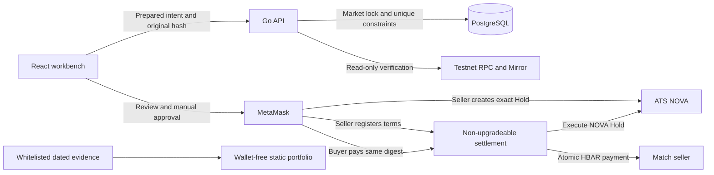
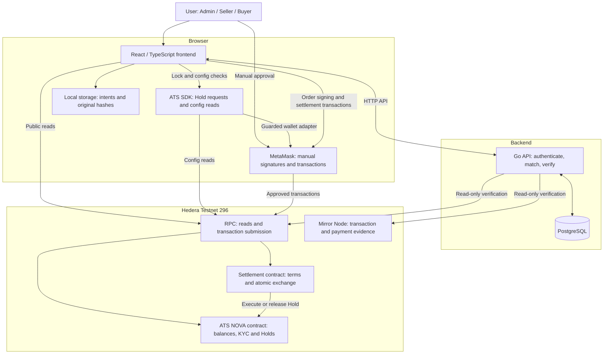
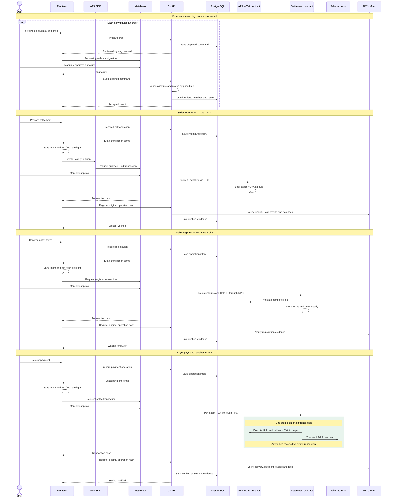

# HoldBook · flow and architecture

Current system, September 12, 2026: signed price-time matching and per-match ATS Hold / atomic HBAR settlement are implemented. All four T08 manual cases and reload/restart checks passed. GitHub Pages serves the frontend, Cloud Run the Go API, and Neon PostgreSQL. See [T08 evidence](evidence/038-t08-manual.md) and [deployment](ai-usage/057-live-deployment.md); this is not a production-security claim.

[Current component/sequence diagrams](#component-and-interaction-diagrams) · [Demo guide](DEMO.md) · [Source verification](SOURCE_VERIFICATION.md)

## Historical T04 recorded flow

NOVA **0.0.10402368**, Hedera Testnet **296**. Seller owns the shares;
Admin is escrow and synthetic KYC issuer. This is the completed run, not a
request to repeat it.

```text
Start: Seller 100, Buyer 0, held 0
  |
  +-- TX 1 · Seller creates Hold 10, escrow = Admin
  |          Seller 90, Buyer 0, held 10
  |
  +-- Read-only · Admin tries execute 6 before Buyer KYC
  |               Rejected: AccountNotKycd / InvalidKycStatus
  |
  +-- SIGNATURE · Admin signs and verifies synthetic Buyer VC
  +-- TX 2 · Admin grants Buyer KYC
  |          Balances unchanged
  |
  +-- Read-only · Seller tries execute 6
  |               Rejected: IsNotEscrow
  +-- Read-only · Admin tries execute 11
  |               Rejected: InsufficientHoldBalance(10,11)
  |
  +-- TX 3 · Admin executes 6 to Buyer
  |          Seller 90, Buyer 6, held 4
  |
  +-- TX 4 · Admin releases 4 to original Seller
             Seller 94, Buyer 6, held 0; no active Hold
```

Four transactions, one VC signature. The three rejection checks are read-only
and have no transaction IDs. Supply stayed **100**, cap **1000**. Acceptance
block: **40241114**, September 8, 2026.

## Historical T05 architecture

T05 deployed and completed September 8, 2026. Final verification: block 40247352.
The recorded T04 flow above remains historical and cannot be restarted in the UI.

```text
Recorded start: Seller 94, Buyer 6, held 0
  Admin deployed NovaHbarSwap — block 40245682
  Seller SDK created Hold 2 for 10 NOVA — block 40246787
    Observed: Seller 84, Buyer 6, held 10
  Read-only wrong-Buyer / wrong-payment rejections — block 40246969
  Buyer paid 1 HBAR — block 40247134
    Same transaction: ATS execute 10 + pay Seller 1 HBAR, or all effects revert
    Observed: Seller 84, Buyer 16, held 0; Seller credited 1 HBAR
  Read-only duplicate rejection — block 40247341; final readback 40247352
```


In this historical T05 slice the application ran in the browser, with external
RPC/Mirror and no application server, database or order book. The current
Go/PostgreSQL/T08 system is described below. Solidity values use tinybars; wallet transaction
values use weibars (1 HBAR = 10^8 tinybars = 10^18 weibars).

## Where it lives

| Responsibility | Source |
| --- | --- |
| Review screens and wallet connection | [App.tsx](../src/App.tsx), [wallet.ts](../src/lib/wallet.ts) |
| Quote, reviews, next action and recovery UI | [TradePanel.tsx](../src/components/TradePanel.tsx) |
| T05 guards, receipt/runtime/Mirror checks and simulations | [trade.ts](../src/lib/trade.ts) |
| Atomic delivery/payment, cancellation and expiry | [NovaHbarSwap.sol](../contracts/NovaHbarSwap.sol) |
| Fixed Hold sequence, simulations and recovery | [hold.ts](../src/lib/hold.ts) |
| Session checks and operation locks | [guards.ts](../src/lib/guards.ts) |
| VC preparation, manual signing and verification | [credentials.ts](../src/lib/credentials.ts) |
| SDK setup and guarded transport | [ats.ts](../src/lib/ats.ts), [transport.ts](../src/lib/transport.ts) |
| Shared state, RPC/Mirror and historical verification | [lifecycle.ts](../src/lib/lifecycle.ts), [nova.ts](../src/lib/nova.ts) |
| Public evidence field whitelist | [evidence.ts](../src/lib/evidence.ts) |

Before submission, recheck signer, chain, asset, state and exact calldata;
persist public intent. Save the returned hash immediately, then attempt one
complete readback within **180 seconds**. An unknown or incomplete result
requires querying the original hash; it is never automatically resubmitted.

Public journals retain only whitelisted fields; RPC/Mirror checks establish
receipt completion. T05 verifies the constructor, runtime, full Hold and same-hash
ATS/swap events, then checks Seller principal separately from network fees.
T02–T04 are closed history. No new VC signature or KYC renewal is part of T05.
Local contract tests model tinybar values without claiming Hedera RPC unit
conversion or real MetaMask acceptance; evidence 032 separately verifies the
completed manual normal flow. Failure/expiry paths remain local VM coverage.

## T06–T07 local unfunded market



The four tables are `markets` (permanent random salt, sequence, effective time,
version), `commands` (prepared payload, local raw signature, digest, durable result),
`orders` (conserved original/remaining/matched/cancelled/expired quantities) and
`matches` (unique sequence/index IDs and resting prices). A single database
transaction serializes every mutation and commits all resulting rows before
success is returned. Restart reads rows; accepted commands are never re-executed.
Prepared but unsigned commands have no order-book effect. Expiry runs each second
and before matching. Invalid signatures do not consume another owner's request.

Browser signing uses the existing wallet session checks, operation lease and
same-origin Web Lock. It persists only whitelisted public intent before prompting.
Unknown results are queried by original ID, without a retry POST. Polling runs
only on the visible Market tab; stale data stays labelled offline and disables
new submissions. The database is authoritative; browser storage is a recovery aid.

Matching itself has no chain transaction, payment or ATS Hold and reserves no
funds. Eligible matches now proceed to the implemented T08 flow below. Historical
T05 records are not inputs to new matches. The loopback/ticker setup above is the
original local T07 configuration; Cloud Run expires stale orders during store
requests instead of relying on a continuously running background ticker.


## T08 — matched settlement (four manual cases verified)



The deployment records the current acceptance-sequence cutoff under the market
lock. Both orders must be newer. Each match has separate operations for Hold,
registration, payment or return. Seller registration and buyer payment confirm
the full terms digest; T07 signatures remain unfunded intent. On-chain one-use
match/Hold mappings and OpenZeppelin's shared guard protect all mutation entries.
An expired Hold remains locked until its return is verified.

The API has no signer. It binds transaction sender/input/value, pinned runtime,
receipt/block, exact same-transaction ATS/settlement events, historical token
balance transitions, asset config/supply/cap and Mirror account/payment/fee data.
A durable original operation survives lost responses, restart and repeated event
observation. Browser leases and the shared Web Lock guard preparation/submission;
late hashes stay available after wallet invalidation. Recovery has one bounded
180-second query, with no transaction retry.

The separate static build imports only React, styles and whitelisted snapshot
JSON. T05 and all four T08 cases have verified dated transaction timelines.
It needs neither the API nor a wallet and contains no transaction controls.

## Component and interaction diagrams

The ATS SDK runs in the browser, not in Go. Go authenticates orders, matches,
persists and independently verifies public evidence; it has no transaction signer.
The diagrams describe the existing implementation, not an additional deployment.



Factory/Resolver config reads are omitted from the sequence below for clarity.
The Admin has already deployed the settlement contract once. Seller and Buyer
refer to the match's trading roles, which can be opposite to their account labels.
Contract calls from MetaMask travel through RPC; the arrow does not imply a
separate direct transport. Transaction hashes identify submissions, not success.



Cancellation and reclaim follow the same prepare → manual approval → contract
execution → independent verification path. Expiry disables payment; it does not
release NOVA automatically. Unknown transactions are recovered using the original
operation/hash, never automatically resubmitted. The static showcase reads a dated
whitelisted JSON snapshot and does not participate in this transaction flow.

Implementation references: [order flow](../src/lib/market.ts),
[settlement and SDK calls](../src/lib/settlement.ts), [SDK checks](../src/lib/ats.ts),
[settlement contract](../contracts/NovaSettlement.sol),
[Go verification](../engine/internal/service/settlement_rpc.go).

## Frontend source layout

- `src/pages/`: Overview, Activity and Settings tab content.
- `src/components/`: Header, NOVA visuals and market/settlement panels and tables.
- `src/lib/`: named application modules for wallet, guards, ATS, credentials,
  NOVA lifecycle, market, settlement and evidence. These contain domain behavior,
  not a generic collection of utilities.
- `src/data/`: contract artifacts and the public showcase snapshot.
- `src/compat/`: existing browser compatibility shims.
- `src/App.tsx`, `main.tsx`, `showcase.tsx`, `styles.css`: application composition,
  entrypoints and shared styles.

Imports use direct relative paths. Add a folder when a real responsibility needs
one; do not add empty utils/hooks/services folders or barrel exports in advance.
Dated evidence may name the original flat source paths; the filenames are
unchanged under the folders above.

## Engine source layout

- `engine/cmd/api/`: process startup, graceful shutdown and HTTP server wiring.
- `engine/internal/matching/`: deterministic in-memory order matching, amounts,
  orders and matches; no database, HTTP or chain dependency.
- `engine/internal/service/`: authenticated API, PostgreSQL persistence and
  read-only settlement verification. These files share the same Store and stay
  in one package instead of introducing wrappers solely to create more folders.
- `engine/internal/service/migrations/`: embedded SQL migrations.
- `engine/internal/service/data/`: embedded settlement contract artifact.

Tests remain beside their implementation. From engine, use `go test ./...`,
`go test -race ./...`, `go vet ./...` and
`go test ./internal/matching -fuzz=FuzzConservation -fuzztime=3s`.
PostgreSQL tests require a dedicated holdbook_test database. The existing
`go build ./cmd/api` and Compose entrypoint remain unchanged.
