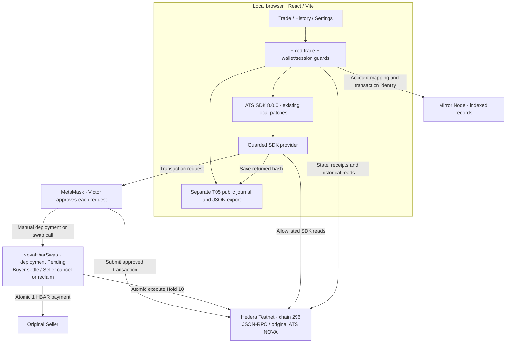

# HoldBook · flow and architecture

[Demo script](DEMO.md) · [Acceptance report](evidence/029-t04-manual.md)

## Recorded flow

NOVA **0.0.10402368**, Hedera Testnet **296**. Seller owns the shares;
Admin is escrow and synthetic KYC issuer. This is the completed run, not a
request to repeat it.

```text
Start: Seller 100, Buyer 0, held 0
  |
  +-- TX 1 · Seller creates Hold 10, escrow = Admin
  |          Seller 90, Buyer 0, held 10
  |
  +-- Read-only · Admin tries execute 6 before Buyer KYC
  |               Rejected: AccountNotKycd / InvalidKycStatus
  |
  +-- SIGNATURE · Admin signs and verifies synthetic Buyer VC
  +-- TX 2 · Admin grants Buyer KYC
  |          Balances unchanged
  |
  +-- Read-only · Seller tries execute 6
  |               Rejected: IsNotEscrow
  +-- Read-only · Admin tries execute 11
  |               Rejected: InsufficientHoldBalance(10,11)
  |
  +-- TX 3 · Admin executes 6 to Buyer
  |          Seller 90, Buyer 6, held 4
  |
  +-- TX 4 · Admin releases 4 to original Seller
             Seller 94, Buyer 6, held 0; no active Hold
```

Four transactions, one VC signature. The three rejection checks are read-only
and have no transaction IDs. Supply stayed **100**, cap **1000**. Acceptance
block: **40241114**, September 8, 2026.

## Current architecture

T05 code is implemented; deployment and manual acceptance remain Pending.
The recorded T04 flow above remains historical and cannot be restarted in the UI.

```text
Start: Seller 94, Buyer 6, held 0 — recheck before starting
  Admin manually deploys NovaHbarSwap (reviewed block time + 86400 expiry)
  Seller SDK creates Hold 10 (escrow = swap, target = Buyer)
    Expected: Seller 84, Buyer 6, held 10
  Read-only wrong-Buyer / wrong-payment checks
  Buyer manually pays 1 HBAR
    Same transaction: ATS execute 10 + pay Seller 1 HBAR, or all effects revert
    Expected: Seller 84, Buyer 16, held 0
  Read-only duplicate-purchase check; verify and export all evidence
```



The application runs in the browser; RPC and Mirror are external services.
There is no application server, database or order book. The payment leg lives
only in the fixed swap contract. Solidity values use tinybars; wallet transaction
values use weibars (1 HBAR = 10^8 tinybars = 10^18 weibars).

## Where it lives

| Responsibility | Source |
| --- | --- |
| Review screens and wallet connection | [App.tsx](../src/App.tsx), [wallet.ts](../src/wallet.ts) |
| Quote, reviews, next action and recovery UI | [TradePanel.tsx](../src/TradePanel.tsx) |
| T05 guards, receipt/runtime/Mirror checks and simulations | [trade.ts](../src/trade.ts) |
| Atomic delivery/payment, cancellation and expiry | [NovaHbarSwap.sol](../contracts/NovaHbarSwap.sol) |
| Fixed Hold sequence, simulations and recovery | [hold.ts](../src/hold.ts) |
| Session checks and operation locks | [guards.ts](../src/guards.ts) |
| VC preparation, manual signing and verification | [credentials.ts](../src/credentials.ts) |
| SDK setup and guarded transport | [ats.ts](../src/ats.ts), [transport.ts](../src/transport.ts) |
| Shared state, RPC/Mirror and historical verification | [lifecycle.ts](../src/lifecycle.ts), [nova.ts](../src/nova.ts) |
| Public evidence field whitelist | [evidence.ts](../src/evidence.ts) |

Before submission, recheck signer, chain, asset, state and exact calldata;
persist public intent. Save the returned hash immediately, then attempt one
complete readback within **180 seconds**. An unknown or incomplete result
requires querying the original hash; it is never automatically resubmitted.

Public journals retain only whitelisted fields; RPC/Mirror checks establish
receipt completion. T05 verifies the constructor, runtime, full Hold and same-hash
ATS/swap events, then checks Seller principal separately from network fees.
T02–T04 are closed history. No new VC signature or KYC renewal is part of T05.
Local contract tests model tinybar values without claiming Hedera RPC unit
conversion or real MetaMask acceptance; those remain manual acceptance checks.
