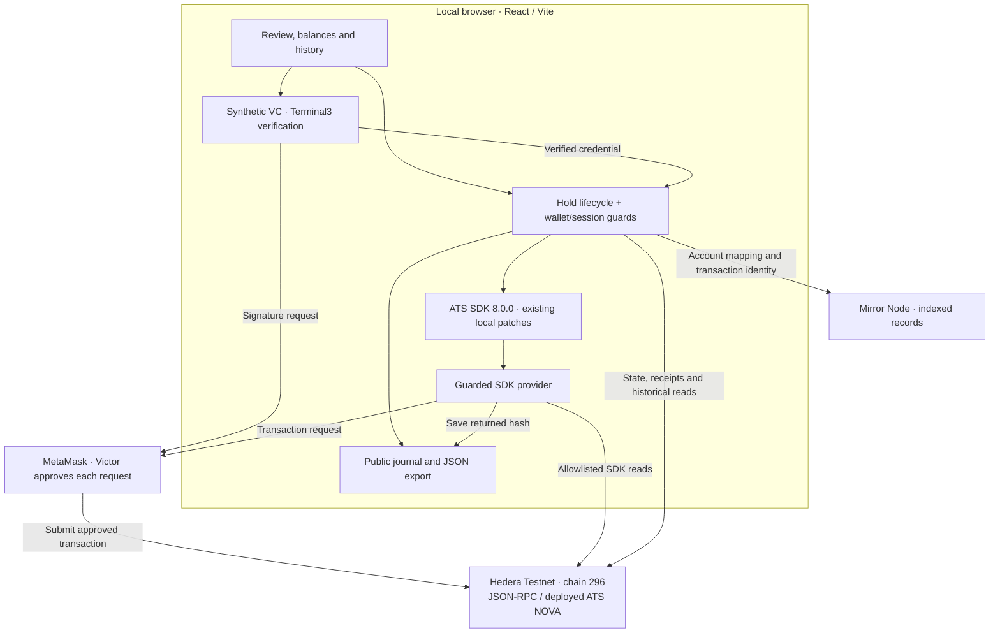

# HoldBook · flow and architecture

[Demo script](DEMO.md) · [Acceptance report](evidence/029-t04-manual.md)

## Recorded flow

NOVA **0.0.10402368**, Hedera Testnet **296**. Seller owns the shares;
Admin is escrow and synthetic KYC issuer. This is the completed run, not a
request to repeat it.

```text
Start: Seller 100, Buyer 0, held 0
  |
  +-- TX 1 · Seller creates Hold 10, escrow = Admin
  |          Seller 90, Buyer 0, held 10
  |
  +-- Read-only · Admin tries execute 6 before Buyer KYC
  |               Rejected: AccountNotKycd / InvalidKycStatus
  |
  +-- SIGNATURE · Admin signs and verifies synthetic Buyer VC
  +-- TX 2 · Admin grants Buyer KYC
  |          Balances unchanged
  |
  +-- Read-only · Seller tries execute 6
  |               Rejected: IsNotEscrow
  +-- Read-only · Admin tries execute 11
  |               Rejected: InsufficientHoldBalance(10,11)
  |
  +-- TX 3 · Admin executes 6 to Buyer
  |          Seller 90, Buyer 6, held 4
  |
  +-- TX 4 · Admin releases 4 to original Seller
             Seller 94, Buyer 6, held 0; no active Hold
```

Four transactions, one VC signature. The three rejection checks are read-only
and have no transaction IDs. Supply stayed **100**, cap **1000**. Acceptance
block: **40241114**, September 8, 2026.

## Current architecture



The application runs in the browser; RPC and Mirror are external services.
There is no application server, database, order book or payment leg.

## Where it lives

| Responsibility | Source |
| --- | --- |
| Review screens and wallet connection | [App.tsx](../src/App.tsx), [wallet.ts](../src/wallet.ts) |
| Fixed Hold sequence, simulations and recovery | [hold.ts](../src/hold.ts) |
| Session checks and operation locks | [guards.ts](../src/guards.ts) |
| VC preparation, manual signing and verification | [credentials.ts](../src/credentials.ts) |
| SDK setup and guarded transport | [ats.ts](../src/ats.ts), [transport.ts](../src/transport.ts) |
| Shared state, RPC/Mirror and historical verification | [lifecycle.ts](../src/lifecycle.ts), [nova.ts](../src/nova.ts) |
| Public evidence field whitelist | [evidence.ts](../src/evidence.ts) |

Before submission, recheck signer, chain, asset, state and exact calldata;
persist public intent. Save the returned hash immediately, then attempt one
complete readback within **180 seconds**. An unknown or incomplete result
requires querying the original hash; it is never automatically resubmitted.

Full VC/proof stays in memory. Public journals retain only whitelisted fields;
RPC/Mirror verification establishes completion. T02 creation and T03 issuance
are closed history. The diagram describes an ATS lifecycle, with synthetic KYC;
payment settlement remains deferred.
