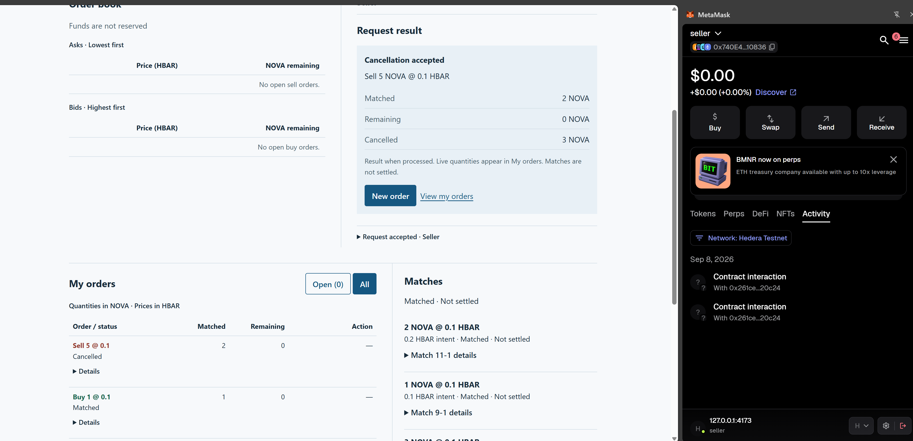
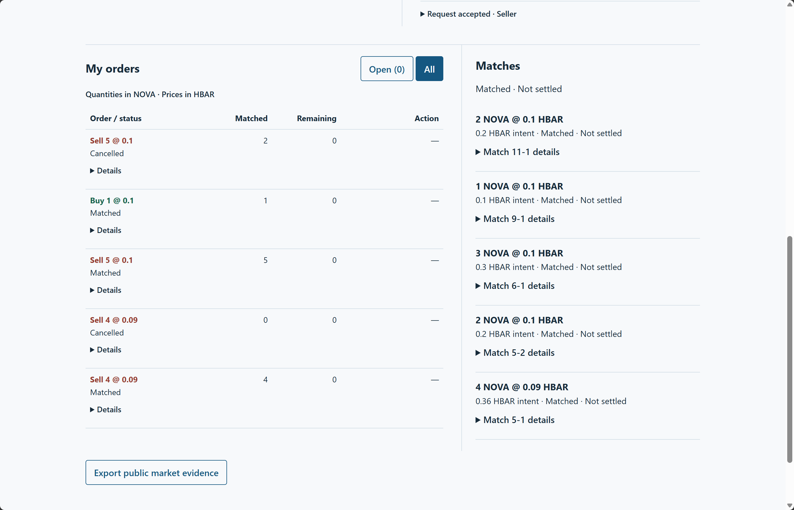
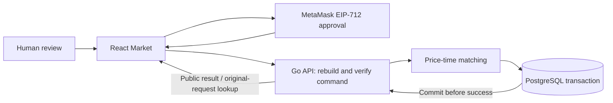

# HoldBook — submission review version

September 8 T08 update: a local matched-settlement workbench and independent static
portfolio are implemented; **all four T08 human cases and persistence checks passed**. See
[implementation report](evidence/037-t08-implementation.md) and
[manual acceptance status](evidence/038-t08-manual.md). Manual038 contains the actual four T08 proofs; the earlier results below remain
dated T05/T07 evidence.

Prepared September 8, 2026 against verified implementation/evidence commit
`ccd6905c539198cc2f0b5c922a8d716137733cd8`. This is a local review document,
not a record of publication or acceptance by an event platform.

## Project summary

HoldBook is a Hedera Testnet prototype for reviewing signed orders and tracing
tokenized-asset trade evidence. Its current Market lets two bound trading
accounts place NOVA/HBAR limit orders, match by price/time priority, and cancel
unmatched quantities. Each command requires manual MetaMask EIP-712 approval.
A Go service verifies commands and commits orders, matches and results to
PostgreSQL before reporting success.

The prototype makes the distinction between agreement and settlement visible:
**Funds are not reserved. Every Market match is “Matched · Not settled”.**
A separately completed fixed trade demonstrates on-chain delivery and payment;
it does not settle the new order book.

## What has been delivered

| Milestone | Delivered behavior | Evidence |
| --- | --- | --- |
| T05: fixed on-chain trade | Recorded 10 NOVA delivery and 1 Testnet HBAR payment, with manual wallet approvals and independently checked receipts/readbacks | [Report](evidence/032-t05-manual.md), [public JSON](evidence/032-t05-manual.json) |
| T06: matching core | Price priority, server FIFO, resting-order prices, partial/multiple fills, expiry, cancellation and self-trade prevention | [Core verification](evidence/033-t06-matching-core.md) |
| T07: signed order service | EIP-712 verification, request idempotency, atomic persistence and original-request recovery | [Implementation checks](evidence/034-t07-implementation.md), [validation JSON](evidence/034-t07-validation.json) |
| T07: Market interface | Book/ticket layout, visible account and side, Open/All orders, direct remainder cancellation, explicit results and responsive histories | [UI report and captures](evidence/036-t07-layout.md) |
| T07: human acceptance | Both account directions, price-priority fills, partial cancellations and state recovery | [Final report](evidence/035-t07-manual.md), [public acceptance JSON](evidence/035-t07-manual.json) |

## Actual demonstration results

The manual run ended with **12 accepted commands, nine orders, five matches,
zero remaining quantity and 1.16 HBAR of unfunded intent**. Initial matching
produced 4 NOVA at 0.09 plus 2 at 0.10, totaling 0.56 HBAR intent. A reverse
Buyer-sell/Seller-buy match passed. The final supplementary Seller order retained
matched2 while cancelling its remaining3. Final browser reload and API restart
preserved orders, matches, domain and state version.

The original six-signature scenario required recovery and supplementary commands.
Extra orders and their cancellations remain in the evidence; the actual run is
not presented as a clean six-signature execution. None of these Market matches
has a settlement transaction ID or proves asset delivery, payment or funding.





## Review in five minutes

1. Read the result summary above and the final T07 acceptance report.
2. Inspect the two captures: remaining quantity is zero; matched and cancelled
   quantities are distinct; all matches are explicitly unsettled.
3. Inspect the public JSON for command IDs, signature digests, accepted results,
   preserved checkpoints and final reload comparisons. It excludes raw signatures.
4. Follow the T05 report separately for the historical chain receipts and payment
   evidence. Do not repeat its completed fixed trade.
5. Read the architecture and test boundaries before assessing settlement claims.

## Architecture and implementation



The database owns the permanent signing salt, accepted sequence, orders, matches
and durable command outcomes. A market-row lock serializes changes. Wallet
session checks, operation locks and original-ID recovery prevent automatic
resubmission after account changes, rejections, timeouts or reloads.
See [full architecture](ARCHITECTURE.md) for the separate historical T05 path.

Pinned stack: React 19.2.8, Vite 8.2.2, TypeScript 7.0.2, Node 24.19.0,
npm 11.17.0, Go 1.27.1, PostgreSQL 18.6, pgx 5.11.0 and go-ethereum 1.17.5.
ATS SDK 8.0.0 and its disclosed local patches remain part of the asset workflow.
Exact dependencies and licenses are in [ATTRIBUTION](ATTRIBUTION.md).

## Local review and verification

With Docker running and the pinned Node/npm installed, use the repository root:

```sh
docker compose up -d --build
npm ci
npm run build
npm run preview
```

Open **http://127.0.0.1:4173**. API: loopback8787; PostgreSQL has no host port.
Keep the project data volume. A fresh checkout does not include the operator's
local database or wallet; use the committed public evidence to review the
completed run. Reading does not require a signature. New signed orders require
Victor's bound accounts and manual approval; no private keys are supplied.

Verification commands and version requirements are in [README](../README.md).
Recorded checks include Go test/race/vet/fuzz, real PostgreSQL fault/concurrency
checks with explicit verifier doubles, 16 local Foundry tests, 104 application
and 36 protobuf tests, typecheck/build, and browser dev/preview checks.
UI fixture tests are distinguished from the actual human acceptance evidence.
The submission-document update itself only checks evidence links and consistency;
it does not claim a new full test run.

## Boundaries and disclosure

- Hedera Testnet 296 only. NOVA and KYC claims are synthetic; no real identity or
  regulatory-compliance claim is made.
- The Market does not reserve balances, assess funded purchasing power, create
  ATS Holds or settle matches. T08 funding/eligibility/settlement is deferred.
- This is a local prototype, not a public production exchange. Existing
  dependency/support limitations remain disclosed in the linked evidence.
- AI assistance and human approvals are indexed in [AI_USAGE](../AI_USAGE.md).
  No agent created a private signer or approved a wallet transaction.
- No project-wide license has been selected. The user-mentioned pre-event draft
  was not supplied or inspected; Victor must resolve event eligibility questions.
  See the [original planning disclosure](prompts/001-planning-record.md).

Before an external submission, Victor still needs to confirm the target event's
requirements, resolve the license/eligibility items, and supply any required
team metadata, demo-video URL and published repository URL. This package neither
asserts those items are complete nor authorizes a push or platform submission.
